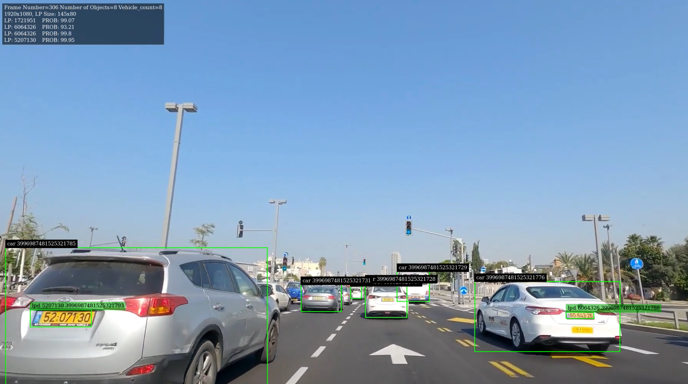

# r6

## Overview
Licsense plate detection project based on Nvidia's Deepstream


<p align="center">

</p>
<h5 align="center">Testing on Israeli license plates</h5>

## Requirements:

Nvidia Deepstream

Quickstart guide for Jetson: 
https://docs.nvidia.com/metropolis/deepstream/dev-guide/text/DS_Quickstart.html

## References:

Deepstream Python Apps Examples:
https://github.com/NVIDIA-AI-IOT/deepstream_python_apps

Deepstream LPR Cpp:
https://github.com/NVIDIA-AI-IOT/deepstream_lpr_app

Deepstream LPR Python:
https://github.com/preronamajumder/deepstream-lpr-python-version

## Usage:

Run the following script:
```
python deepstream_kvish_shesh.py <input_video.264>
```
Currently the pipeline only supports .264 streams, in order to create .264 stream file from an .mp4 container file using ffmpeg:

```
ffmpeg -i output.mp4 -codec:v libx264 -aud 1 output.264
```

Using live video from an USB camera requires changing the following flag in `deepstream_kvish_shesh.py`:

```python
LIVE_VIDEO = True
```

and then: 
```
python deepstream_kvish_shesh.py /dev/video0
```

Saving the video to an .mp4 file (Currently outputs to output.mp4 at the main directory)

```python
SAVE_VIDEO = True
```

## Pipeline Overview:

The script `deepstream_kvish_shesh.py` contains two core functions:

`main` -  is the function in which the GStreamer pipeline is created.
For a live feed from an USB camera the pipeline contains the following elements:


#| Element        | Properties     | Comments  |
-| -------------- |----------------|-----------|
1| v4l2src        | ('device', args[1]) | Source |
2| capsfilter     | ('caps', Gst.Caps.from_string("video/x-raw, framerate=30/1")) | v4l2src capsfilter |
3| videoconvert   |                | videoconvert to make sure a superset of raw formats are supported |
4| nvvideoconvert |  | nvvideoconvert to convert incoming raw buffers to NVMM Mem (NvBufSurface API) |
5| capsfilter     | ('caps', Gst.Caps.from_string("video/x-raw(memory:NVMM)")) | nvvideoconvert capsfilter |
6| nvstreammux    | ('width', 1920), ('height', 1080), ('batch-size', 1), ('batched-push-timeout', 400000) | Create nvstreammux instance to form batches from one or more sources. |
7| nvinfer        | ('config-file-path', "./configs/trafficamnet_config.txt") | pgie - Deepstream inference element for primary detector (Cars, Bikes, Pedestrians, Signs) |
8| nvtracker      | Tracker properties are parsed from './configs/lpr_sample_tracker_config.txt' | Tracker - Deepstream element to track detected objects |
9| nvinfer        | ('config-file-path', "./configs/lpd_us_config.txt"), ('process-mode', 2) | sgie1 - Deepstream inference element for secondary detector (Licsense Plate Detection) |
10| nvinfer       | ('config-file-path', "./configs/lpr_config_sgie_us.txt"), ('process-mode', 2) | sgie2 - Deepstream inference element for OCR (Licsense Plate Recognition) |
11| nvvideoconvert|                | Use convertor to convert from NV12 to RGBA as required by nvosd |
12| nvdsosd       | ('display-text', 1), ('display-bbox', 1) | Create OSD to draw on the converted RGBA buffer |
13| nvegltransform|                | Deepstream element required in aarch64 for nveglglessink |
14| nveglglessink | ('sync', False) | Sink - render the osd output |

`osd_sink_pad_buffer_probe` - This function acts as a probe that is added to the sink pad of the osd element. The main purpose of this probe function is to handle metadata recieved from the pipeline (Number of cars, Number of licsense plates, LP text etc').

This metadata has a standard structure that can be seen in the following diagram:
<p align="center">

</p>

**Information Extraction:**

Our prob recieves BatchMeta and loops through all FrameMeta objects, in every FrameMeta objects it loops through ObjectMeta objects, and in every ObjectMeta object it loops through ClassifierMeta objects and extracts information in which we are interested.

For example, if we are intersted in a specific LP number and probability, we will extract it through label_info attribute in NvDsClassifierMeta object:

```python
label = label_info.result_label
prob = label_info.result_result_prob
```

**Metadata Visualization:**

The visualization is done via NvDsDisplayMeta object, both custom and out of the pipeline data.

For more information:

https://docs.nvidia.com/metropolis/deepstream/dev-guide/text/DS_plugin_metadata.html

## Neural Network Review:

The input frame goes through 3 neural networks in the pipeline